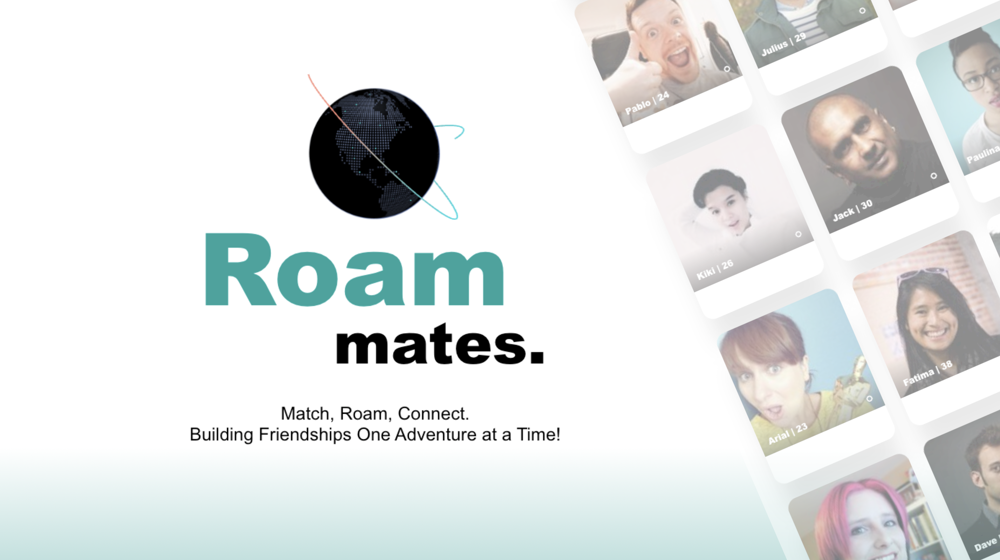
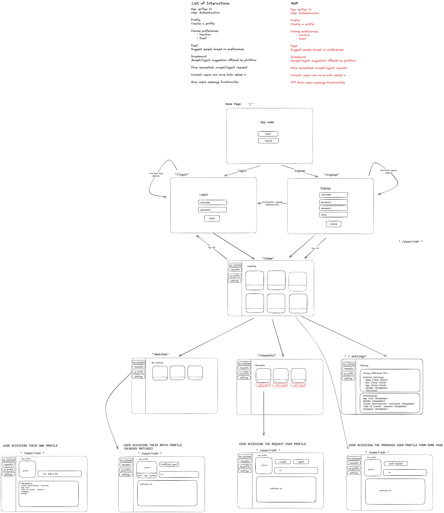

# RoamMates - Find Your Travel Buddy!

RoamMates is a web app that helps you connect with prospective travel buddies who share similar interests and preferences. Whether you're planning a solo adventure or looking for a companion to explore the world together, RoamMates has got you covered.

## Demo

[](https://youtu.be/9sq5-AofdZE)

### [Watch the Demo Video](https://youtu.be/9sq5-AofdZE)


## Installation

1. Navigate to the `api` directory and run the server with::

    ```bash
    python app.py
    ```

2. Navigate to the `frontend` directory, install npm dependencies, and start the server:

    ```bash
    cd frontend
    npm install
    npm start
    ```

## Collaborators

- [Amina Ba](https://github.com/xAmiBa)
- [Piotr Surowiec](https://github.com/PiotrSurowiec90)
- [Dave O'Donnell](https://github.com/SoundMotives)
- [Daniel Kruszewski](https://github.com/DANKRUSZ)


## Features

- **Signup, Login, Logout:** Create an account, log in, and log out securely.
- **User Profiles:** Customize your profile with age, gender, bio, and an image.
- **Preferences:** Set preferences such as preferred continent, travel buddy's age, gender, and preferred travel time.
- **Filtering Algorithm:** Work in progress - Receive suitable match suggestions based on your preferences.
- **Match Requests:** Work in progress - Send and receive match requests, accept or reject matches.
- **Matches and Requests Pages:** Access pages dedicated to your matches and incoming match requests.
- **Settings:** Change your preferences easily in the settings.


## Tech Stack & Planning

### Tech Stack

- **Backend:** Python, PostgreSQL
- **Frontend:** JavaScript, React

### Planning and Wireframing

In the initial stages of RoamMates development, we carefully planned our approach to ensure a smooth and efficient process. Utilizing wireframes, we visualized the layout and structure of our application before diving into development.



The wireframes served as a blueprint for our User Experience (UX) design, allowing us to map out user interactions and interface elements. This deliberate planning phase played a crucial role in shaping the user journey and refining our ideas before implementation.

### Development Phases

Our development process was divided into two main phases:

1. **MVP (Minimum Viable Product):** We dedicated the first week to building the core functionalities necessary for RoamMates to function as a basic travel buddy matching platform. This approach allowed us to swiftly launch a working version and gather valuable feedback.

2. **Additional Features:** With a solid foundation in place, we allocated the following week to implement additional features and refine the user experience. This phase focused on enhancing user engagement.

By adopting this iterative development approach, we aimed to deliver a functional and user-friendly application within the defined two-week deadline. Our continuous focus on both MVP and additional features ensured a balance between a quick release and a feature-rich product.

Feel free to explore, contribute, and start your journey with RoamMates! Happy travels! 🌍✈️
